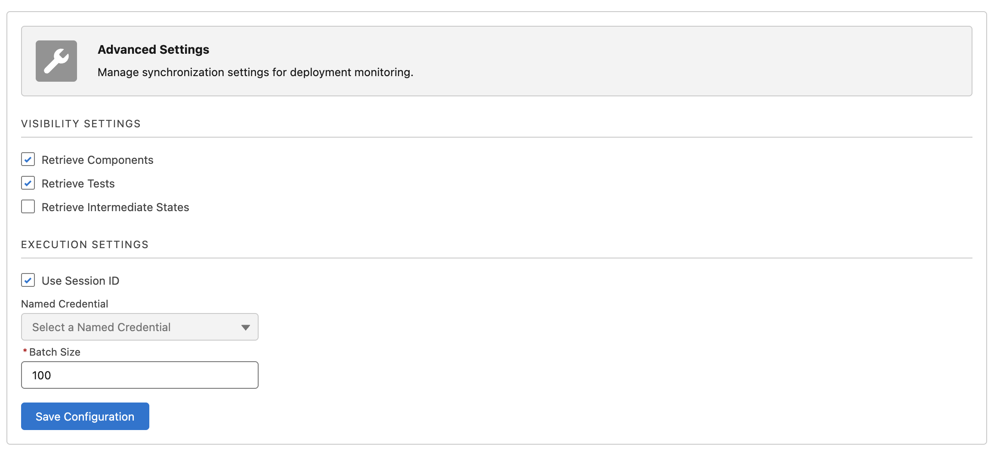
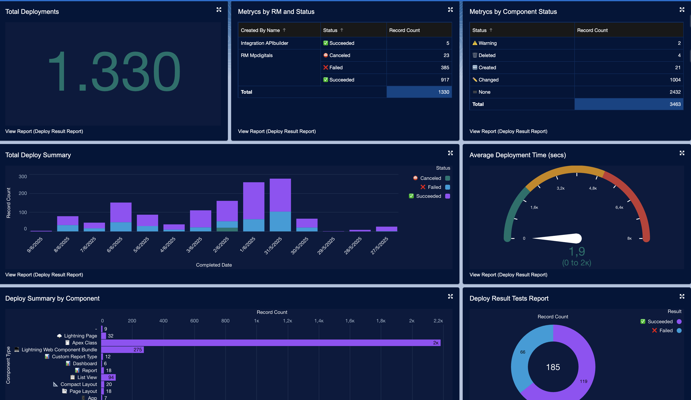
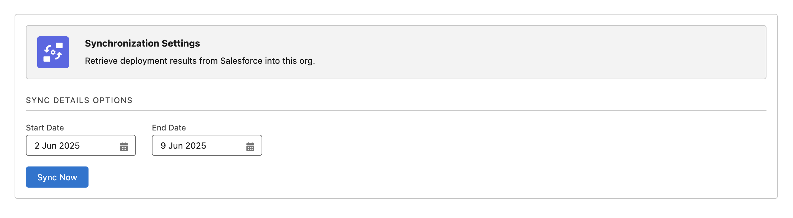
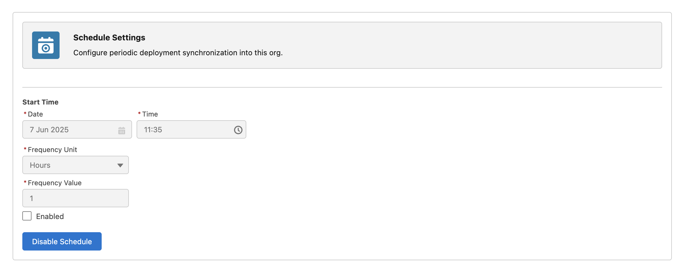
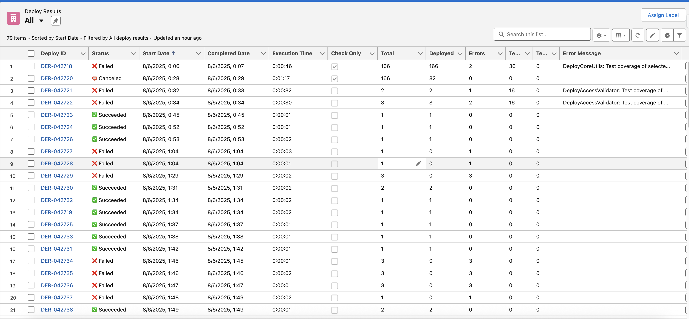
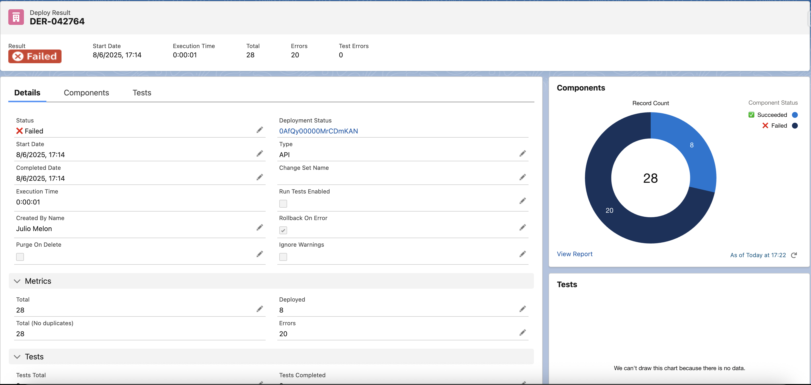
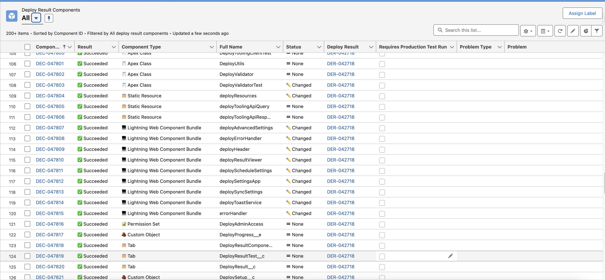
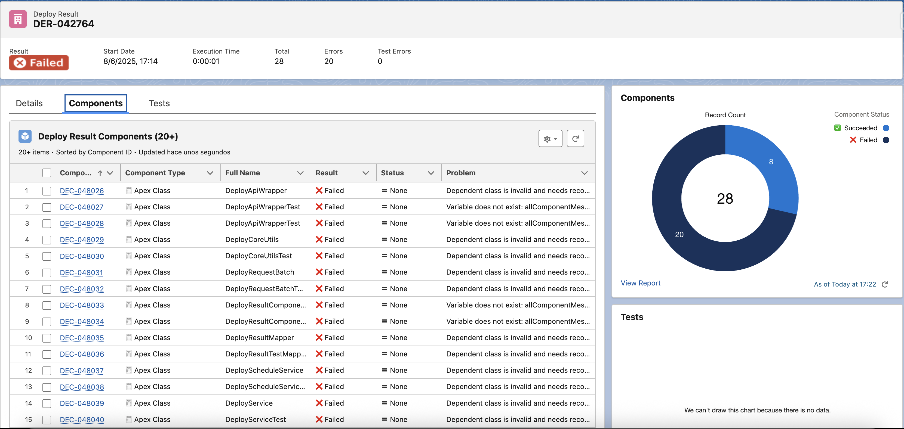
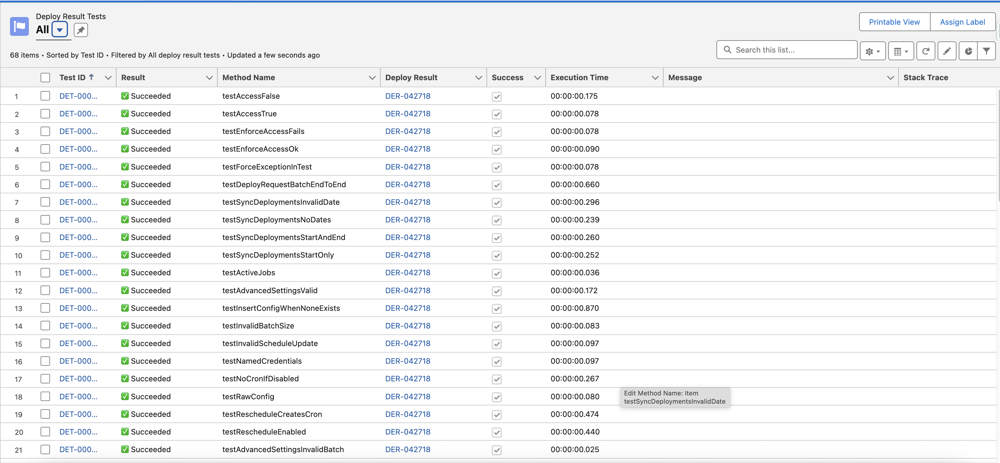
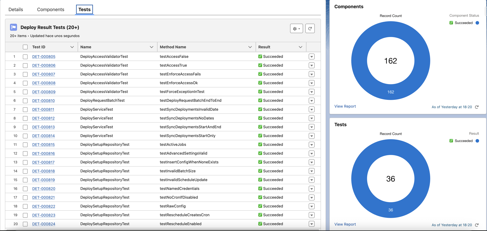

# 🧙 Lug Deploy Tracker (Beta)

 

**Beta version of a 100% native Salesforce solution to visually track, analyze and review deployment activity over time**, complementing Salesforce’s default DeployRequest retention with extended historical tracking.  
It also allows you to easily review **deployed components**, quickly identify **failed deployments**, access **deployment status** directly from deployment result records, and gain deeper visibility into your deployment process.

---

## Installation 📥

You can install **Lug Deploy Tracker** in your Salesforce org using one of the following links:

 

---

## 🔧 Setup

You **must enable one of the following authentication methods** before using the app:

### Option 1: Session ID authentication (⚠️ uses Modify All Data permission)

- Assign the permission set **DeployAdminAccessSID** to the user.
- Select “Use Session ID” in the advanced settings.

### Option 2: Named Credential authentication (recommended, least privilege)

- Create a **Named Credential for the Tooling API** with the proper connected app.
- Assign the permission set **DeployAdminAccessNC** to the user.
- Select the Named Credential in the advanced settings.

👉 [How to create a Named Credential](https://help.salesforce.com/s/articleView?id=platform.perm_uapa_create_a_named_credential.htm&type=5)

---

## Overview ✨

**Lug Deploy Tracker** is a Salesforce solution designed to track and analyze deployment activity by retrieving `DeployRequest` data via the Tooling API.

This app is **heavily inspired** by [Nebula Logger](https://github.com/jongpie/NebulaLogger) — though much simpler and focused on deployment tracking.  
Some structural and UI ideas are also borrowed from [chat-gpt-sfdc](https://github.com/ArnasBaronas/chat-gpt-sfdc).

---

## Features ⚙️

- 🔍 Synchronize `DeployRequest` records using Tooling API.
- 📊 Store detailed results in:
  - `DeployResult__c`
  - `DeployResultComponent__c`
  - `DeployResultTest__c`
- ⏰ Schedule automatic syncs (e.g. every hour).
- 🎛️ Configure via Lightning Web Components (LWC):
  - Manual sync
  - Schedule settings
  - Advanced options
- 🚥 Track progress with Platform Events and live progress bar.

---

## Dashboard Example 📊

---

## Usage 🖥️

### Manual Synchronization

- Use the **Synchronization Settings** tab.
- Leave “Start Date” empty to fetch last 30 days.
- Leave “End Date” empty to fetch up to today.

### Scheduled Synchronization

- Configure start time + frequency (e.g. every 2 hours from 16:00).
- Next execution is displayed in the form.

---

## Visual Results 🔍

### Deploy Results

### Deploy Result Details

### Deploy Result Components

### Deploy Result Components Related List

### Deploy Result Tests

### Deploy Result Tests Related List

---

## Architecture Overview 🏗️

### LWC Components

- `deploySettingsApp`
- `deployHeader`
- `deploySyncSettings`
- `deployScheduleSettings`
- `deployAdvancedSettings`
- `deployErrorHandler`
- `deployToastService`

### Apex Classes

**Service Layer**
- `DeployService`
- `DeployScheduleService`
- `DeployRequestBatch`

**Integration Layer**
- `DeployToolingClient`
- `DeployToolingClientInterface`
- `DeployToolingApiMock`

**Data Access Layer**
- `DeploySetupRepository`
- `DeployValidator`
- `DeployAccessValidator`
- `DeployCoreUtils`
- `DeployUtils`
- `DeployConstants`

**Data Mapping**
- `DeployApiWrapper`
- `DeployResultMapper`
- `DeployResultComponentMapper`
- `DeployResultTestMapper`

### Platform Events

- `DeployProgress__e`

### Custom Objects

- `DeployResult__c`
- `DeployResultComponent__c`
- `DeployResultTest__c`

### Configuration

- `DeploySetup__c` (Custom Setting)

---

## Next Steps 🚀

Planned features:

- ⚙️ Partial result handling for large batches
- 🗑️ Auto-purge of old records
- 📈 Visual code/flow coverage metrics
- 🗂️ Summary of components and test class errors

---

## Disclaimer ⚠️

This package is provided “as is”, with no guarantees. Use at your own risk.

---

## Contact & Feedback 📬

📧 develop@mpdigitals.com
